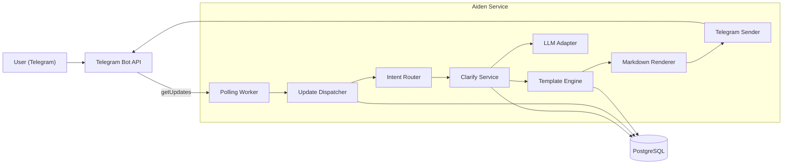
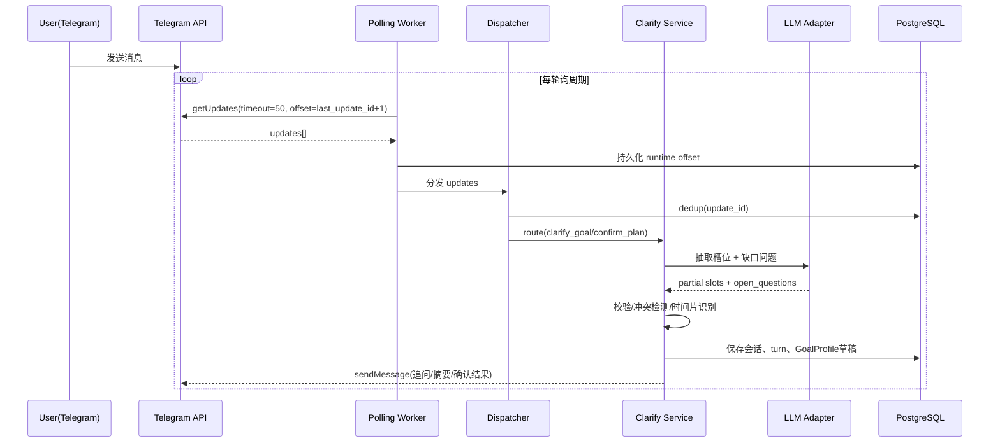
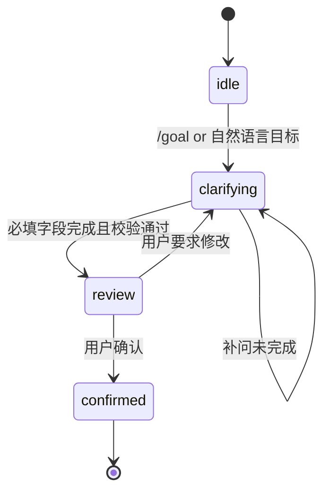
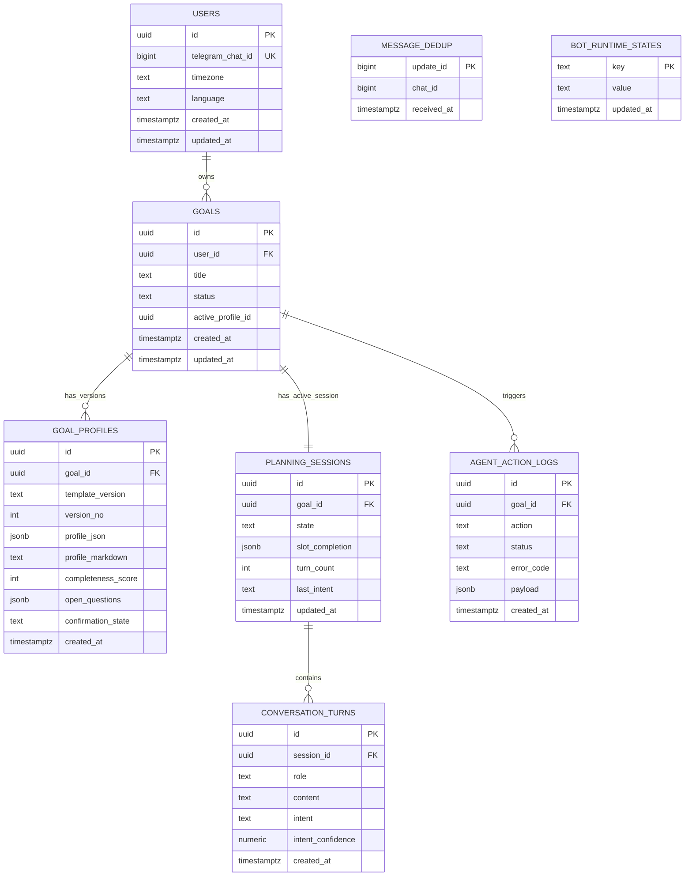

# Aiden M1 技术文档（目标澄清与模板冻结）

## 0. 文档信息

- 文档版本：`m1-td-v2`
- 对应 PRD：`/Users/congregalis/Code/Aiden/PRD.md`（v3.1）
- 里程碑：M1（第 1-2 周）
- 目标读者：后端研发、AI 应用研发、测试
- 状态：Ready for Dev
- 本版变更：Telegram 接入由 Webhook 调整为 Long Polling

## 1. M1 目标与范围

### 1.1 M1 目标（必须完成）

1. 完成 Telegram Bot 接入（Long Polling 模式）。
2. 完成 `User`、`Goal`、`GoalProfile` 的最小可用存储。
3. 完成目标澄清状态机（多轮追问、字段补齐、用户确认）。
4. 完成字段校验、冲突检测、时间片识别能力。
5. 冻结并落地 `Goal Brief v1` 与 `Plan Pack v1` 模板定义（M1 仅产出 Goal Brief）。
6. 打通 `目标澄清 -> Goal Brief v1 -> 用户确认` 闭环。

### 1.2 M1 非目标（明确不做）

1. 不做 `Plan Pack` 生成与执行链路（M2 实现）。
2. 不做打卡、周汇总、副目标池的完整交互（M2 实现）。
3. 不做 `adjust_plan` 手动调参（M3 实现）。
4. 不做自动调整、复杂多目标并行排程。

### 1.3 M1 出门标准（Go/No-Go）

- 任意新用户可在 8 分钟内完成澄清并得到 `Goal Brief v1`。
- 必填字段完整率 100%。
- 输出对象通过 `goal_brief_v1` schema 校验。
- 用户可明确确认 Goal Brief（`confirmation_state=confirmed`）。

## 2. 总体架构

### 2.1 架构图（Long Polling）

### 2.2 关键流程图（Long Polling 顺序）

### 2.3 运行拓扑与并发策略

1. M1 仅启用单实例 `Polling Worker`，避免 offset 竞争。
2. `Dispatcher` 内部串行处理同一个 `chat_id` 的消息，避免会话乱序。
3. 跨用户消息可并发处理（worker pool，默认并发 8）。
4. `getUpdates.timeout=50s`，空轮询后立即发起下一轮。

## 3. 模块设计

### 3.1 Telegram 接入模块（Long Polling）

#### 3.1.1 外部 API 使用

- 轮询拉取：`getUpdates`
- 回复发送：`sendMessage`
- 启动前检查：`getMe`
- 进程内管理：`offset` 从 `bot_runtime_states` 读取并持续更新

#### 3.1.2 核心配置

- `TELEGRAM_BOT_TOKEN`
- `TELEGRAM_POLL_TIMEOUT_SEC`（默认 `50`）
- `TELEGRAM_POLL_INTERVAL_MS`（默认 `200`，空轮询后的等待）
- `TELEGRAM_ALLOWED_UPDATES`（默认只开 `message`）

#### 3.1.3 幂等与断点续传

- 幂等键：`telegram_update_id`
- 幂等存储：`message_dedup(update_id PK, received_at)`
- offset 存储：`bot_runtime_states(key='telegram_last_update_id')`
- 进程重启后从 DB offset 继续拉取，避免漏消息

#### 3.1.4 命令支持（M1）

- `/start`：初始化用户与欢迎文案
- `/goal`：进入或继续目标澄清
- `/help`：返回帮助信息
- 其他命令先返回“该能力将在后续里程碑开放”

### 3.2 意图路由与状态机

#### 3.2.1 意图识别（M1 子集）

- `clarify_goal`
- `confirm_plan`
- `fallback_unknown`

#### 3.2.2 状态机定义

#### 3.2.3 会话推进规则

1. 每轮最多问 1-2 个问题。
2. 优先补齐必填字段，再补可选字段。
3. 每 3 轮自动输出一次当前摘要与“是否继续优化”。
4. 任一必填字段缺失时，不允许进入 `review`。

### 3.3 槽位抽取与校验

#### 3.3.1 Goal Brief 必填槽位（M1）

- `main_goal`
- `success_criteria`（3-5 条）
- `current_level`
- `time_budget`（`hours_per_week` 或 `time_slots`）
- `constraints`
- `risk_flags`

#### 3.3.2 时间预算标准化

- 若输入“每周 X 小时”：写入 `hours_per_week`。
- 若输入“每天/每周碎片时间”：归一化为 `time_slots[]`。
- 若识别为碎片化用户，自动补充默认建议：`15/30` 分钟任务片。

#### 3.3.3 冲突检测规则（M1）

1. `deadline` 很近且总可投入不足以覆盖目标规模 -> 输出降级建议。
2. `constraints` 与 `time_budget` 自相矛盾（如“工作日无时间”但填“工作日每天 2h”）-> 请求澄清。
3. `success_criteria` 无法验收（纯主观表述）-> 追问可量化标准。

### 3.4 模板引擎（冻结）

#### 3.4.1 Template Registry

- `goal_brief_v1`（M1 启用）
- `plan_pack_v1`（M1 冻结 schema，M2 启用生成）

#### 3.4.2 校验器

- 采用 JSON Schema 校验结构完整性
- 采用业务规则校验语义完整性（如 success_criteria 条数）
- 校验失败返回：
  - `error_code`
  - `field_path`
  - `repair_hint`

#### 3.4.3 输出契约（M1）

每次澄清输出都必须包含：

- `template_version`
- `completeness_score`（0-100）
- `open_questions`（可为空数组）

`completeness_score` 计算：

- 必填字段完整性：70 分
- 字段可验收质量：20 分
- 冲突消解完成度：10 分

### 3.5 渲染器（用户可读文本）

- 输入：结构化 `Goal Brief v1` JSON
- 输出：Markdown 摘要（目标、成功标准、时间预算、风险、待确认项）
- 要求：文本与 JSON 使用同一快照版本，避免展示与存储不一致

## 4. 数据模型（M1 落地）

### 4.1 表设计（最小可用）

1. `users`
2. `goals`
3. `goal_profiles`
4. `planning_sessions`
5. `conversation_turns`
6. `agent_action_logs`
7. `message_dedup`
8. `bot_runtime_states`

### 4.2 关键字段

#### `users`

- `id` (uuid, pk)
- `telegram_chat_id` (bigint, unique)
- `timezone` (text, default `Asia/Shanghai`)
- `language` (text, default `zh-CN`)
- `created_at`, `updated_at`

#### `goals`

- `id` (uuid, pk)
- `user_id` (uuid, fk users.id)
- `title` (text)
- `status` (text: `draft/active/archived`)
- `active_profile_id` (uuid, nullable)
- `created_at`, `updated_at`

#### `goal_profiles`

- `id` (uuid, pk)
- `goal_id` (uuid, fk goals.id)
- `template_version` (text, must be `goal_brief_v1`)
- `version_no` (int, default 1)
- `profile_json` (jsonb)
- `profile_markdown` (text)
- `completeness_score` (int)
- `open_questions` (jsonb)
- `confirmation_state` (text: `pending/confirmed`)
- `created_at`

#### `planning_sessions`

- `id` (uuid, pk)
- `goal_id` (uuid, fk goals.id)
- `state` (text: `idle/clarifying/review/confirmed`)
- `slot_completion` (jsonb)
- `turn_count` (int)
- `last_intent` (text)
- `updated_at`

#### `conversation_turns`

- `id` (uuid, pk)
- `session_id` (uuid, fk planning_sessions.id)
- `role` (text: `user/assistant/system`)
- `content` (text)
- `intent` (text)
- `intent_confidence` (numeric)
- `created_at`

#### `message_dedup`

- `update_id` (bigint, pk)
- `chat_id` (bigint)
- `received_at` (timestamptz)

#### `bot_runtime_states`

- `key` (text, pk)
- `value` (text)
- `updated_at` (timestamptz)

### 4.3 约束与索引

- `goals(user_id, status)` 复合索引
- `goal_profiles(goal_id, version_no DESC)` 索引
- `planning_sessions(goal_id)` unique（单目标单活跃会话）
- `conversation_turns(session_id, created_at)` 索引
- `message_dedup(update_id)` 主键
- `bot_runtime_states(key)` 主键

### 4.4 ER 图（M1）

### 4.5 设计考量：`planning_sessions` 与 `conversation_turns`

#### 4.5.1 为什么同时设计两个表

- `planning_sessions` 负责保存会话“当前态快照”，用于驱动状态机实时决策。
- `conversation_turns` 负责保存会话“完整历史流水”，用于追溯、分析与上下文回放。
- 两者拆分后形成“快照层 + 日志层”，避免职责耦合。

#### 4.5.2 `planning_sessions`（状态快照层）的设计价值

- 快速读取当前状态（`state`、`slot_completion`、`turn_count`、`last_intent`），降低每轮处理延迟。
- 支持进程重启后快速恢复当前澄清进度，不需要重放全量历史消息。
- 支持状态机一致性约束（单目标单活跃会话），减少并发乱序导致的状态错乱。

#### 4.5.3 `conversation_turns`（对话日志层）的设计价值

- 以追加写方式完整记录每轮用户/助手输入输出，保证可审计与可追溯。
- 支持线上问题定位、会话回放、意图识别质量分析与补问策略优化。
- 为 LLM 提供“最近 N 轮上下文”数据来源，提升抽取与追问准确性。

#### 4.5.4 分层收益总结

- 在线链路读 `planning_sessions`，性能稳定。
- 分析与复盘读 `conversation_turns`，信息完整。
- 状态更新与历史沉淀解耦，便于后续扩展（归档、统计、质量评估）。

## 5. LLM 集成设计（M1）

### 5.1 能力边界

1. 信息抽取：从自然语言提取槽位到 JSON。
2. 追问生成：根据缺口生成 1-2 个最关键问题。
3. 文本摘要：将 Goal Brief 结构化结果转为可读说明。

### 5.2 调用契约

- 输入：最近 N 轮对话 + 当前槽位快照 + schema 约束
- 输出：严格 JSON（禁止自由文本混排）
- 超时：`10s`（超过即降级）
- 重试：最多 1 次（指数退避 200ms）

### 5.3 失败降级

- LLM 超时/解析失败：进入规则模板追问（不阻断会话）。
- 连续 2 次失败：返回固定兜底话术并提示稍后重试。
- 所有失败写入 `agent_action_logs`（含错误码与上下文 hash）。

## 6. 接口与错误码

### 6.1 内部应用错误码（M1）

- `CLARIFY_REQUIRED_FIELD_MISSING`
- `CLARIFY_CONFLICT_DETECTED`
- `TEMPLATE_SCHEMA_INVALID`
- `LLM_TIMEOUT`
- `LLM_PARSE_FAILED`
- `POLLING_DUPLICATED_UPDATE`
- `POLLING_GET_UPDATES_FAILED`
- `POLLING_OFFSET_PERSIST_FAILED`

### 6.2 用户侧提示策略

- 错误文案必须可执行（告诉用户下一步怎么补充）。
- 不暴露内部堆栈或模型信息。
- 高风险冲突优先提示“降范围/延周期/降难度”三选一建议。

## 7. 可观测性与指标

### 7.1 埋点事件（M1）

- `polling_cycle_started`
- `polling_cycle_succeeded`
- `polling_cycle_failed`
- `goal_started`
- `goal_brief_generated`
- `goal_brief_confirmed`
- `template_validation_failed`

### 7.2 关键 SLI/SLO（M1）

- `goal_brief_generation_success_rate >= 99%`
- `goal_brief_generation_p95 <= 15s`
- `schema_validation_pass_rate >= 98%`
- `polling_cycle_success_rate >= 99.5%`
- `polling_update_lag_seconds_p95 <= 5`

### 7.3 日志与追踪

- 每次请求贯穿 `trace_id`
- 结构化日志字段：`goal_id`、`session_id`、`intent`、`template_version`、`update_id`
- PII 脱敏：消息文本只保存摘要 hash（原文仅短期保留）

## 8. 测试计划

### 8.1 单元测试

1. 槽位抽取结果映射与归一化。
2. 冲突检测规则（正反案例）。
3. schema + 业务校验器。
4. completeness_score 计算。
5. offset 读写与重启恢复。

### 8.2 集成测试

1. Long Polling -> 状态机 -> DB 写入链路。
2. 重复 update 幂等验证。
3. LLM 异常降级与补问链路。
4. Telegram API 异常重试与退避。

### 8.3 端到端测试（M1 验收）

1. 新用户 8 分钟内完成 Goal Brief 确认。
2. 截止日期冲突时给出降级建议。
3. 碎片化用户自动识别并输出 15/30 分钟策略。
4. 进程重启后不丢消息、不重复回复。

## 9. 研发排期（第 1-2 周）

### 第 1 周

1. D1-D2：项目脚手架、配置、Long Polling 接入、用户落库。
2. D3-D4：状态机、会话存储、对话回放、命令路由。
3. D5：Goal Brief schema 与 validator、渲染器首版。

### 第 2 周

1. D6-D7：LLM 抽取与追问链路、冲突检测、时间片识别。
2. D8：端到端联调与兜底策略。
3. D9：测试补齐与指标埋点。
4. D10：验收演练、文档冻结、发布 M1 tag。

## 10. 开发准备清单（DoR）

- [ ] PostgreSQL 实例与迁移工具可用。
- [ ] Telegram Bot Token 已配置。
- [ ] LLM API Key 与超时重试参数已注入。
- [ ] `goal_brief_v1` / `plan_pack_v1` schema 文件冻结并评审通过。
- [ ] 错误码与用户文案表完成产品评审。

## 11. 验收清单（DoD）

- [ ] 用户可通过自然语言进入并完成目标澄清。
- [ ] `Goal Brief v1` 输出含 `template_version/completeness_score/open_questions`。
- [ ] `confirmation_state` 可由 `pending -> confirmed`。
- [ ] 冲突场景可触发修正建议，不会直接产出错误 Goal Brief。
- [ ] Long Polling 重启恢复后无漏消息与重复回复。
- [ ] 所有 M1 关键事件可在日志与埋点中检索。

## 12. 研发任务拆解索引

M1 细粒度可执行任务清单见：

- `/Users/congregalis/Code/Aiden/docs/m1-dev-todo.md`
